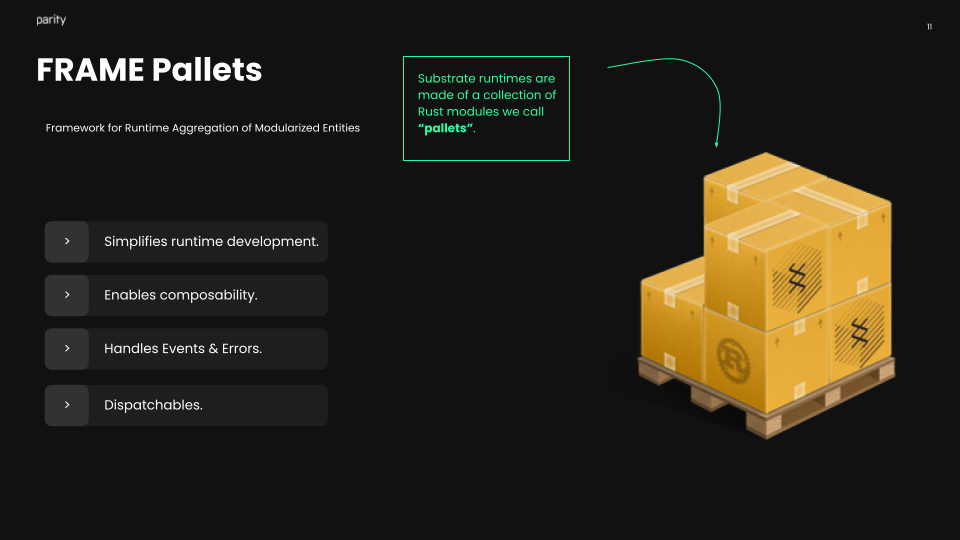

# Getting Started

To follow along for this workshop, you'll either need:

- To have your local environment set up with Rust and a compiled version of the Node Template
- OR a Github account to use the [Substrate Playground](https://playground.substrate.dev/?deploy=node-template)

# What is Substrate?

Being a framework and toolkit for blockchain development, Substrate is a lot of things.
One of those things is that it enables you to write application specific blockchains by writing specialized [runtimes](https://docs.substrate.io/v3/concepts/runtime/).

Substrate provides a way to easily write runtime logic using pallets written with [FRAME](https://docs.substrate.io/v3/runtime/frame/) &mdash; Substrate's opiniated toolkit for writing runtime logic.
You can think of comparing the runtime of a Substrate blockchain to a crate, carrying all of its business logic in a multitude of different pallets. 

In this workshop, we'll focus on writing a pallet for a blockchain specialized in managing the decentralized creation and ownership of crypto Kitties. 

