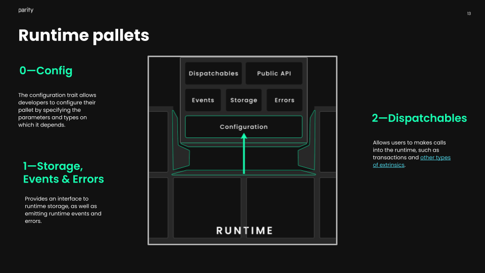

# Runtime engineering

The runtime of a Substrate blockchain acts as the state transition function, where all of the business logic of our chain lives.
A runtime typically contains a number of pallets that, together, define the business logic of the chain.
Each [pallet](https://docs.substrate.io/v3/runtime/frame/#pallets) alone provides ways for accounts and other pallets to interact with them.

As runtime engineers, a pallet provides you a way to:

* Specify storage items for your blockchain
* Specify some callable functions for your blockchain
* Emit events and errors
* Specify some custom logic for callable functions
* Generate metadata

This gives you a lot of flexibility for the logic you're writing, but this means you have a lot of responsibility for carefully handling errors.

<!-- slide:break-40 -->

Important concepts: 

* Weights
* Verify first, write last
* Storage read/write efficiency
* Error handling