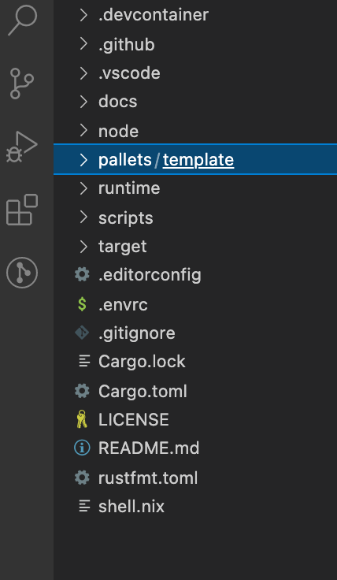

# Project structure

Using the node template the easiest way to get your Substrate blockchain up and running.
You should have that already installed and compiled. 
Compilation time takes a while at first but subsequent builds won't take as long.

When you run: 
```bash
./target/release/node-template --dev
```

.. you've just launched a single node, proof of authority local network with basic account and balances capabilities, transaction payment functionality and Sudo governance. 👊

To kill your node, hit `Ctrl + c`.

Now, let's take a closer look at the structure of the node template we'll be working with. 👀

1. Open up your code editor with your compiled node template.
(Or, if you're using the Substrate Playground, go to a Node Template instance and hit `Ctrl + c` to stop the chain).
1. Notice the `node`, `pallets` and `runtime` folders
1. Go to `runtime/src/lib.rs` and `Ctrl + f` "construct_runtime!(".
This should take you to line 290.

The `construct_runtime` macro compiles externally published pallets to generates the state transition function of our chain. 
These are the pallets in the runtime of our node template:

* 🛠 `System: frame_system`: core system level functionality.
* 🎲 `RandomnessCollectiveFlip: pallet_randomness_collective_flip`: provides on-chain pseudo-randomness.
* ⌚️ `Timestamp: pallet_timestamp`: provides on-chain timestamping utilities.
* 👮 `Aura: pallet_aura`: proof of authority consensus.
* 👴 `Grandpa: pallet_grandpa`: block finalization utility.
* 💰 `Balances: pallet_balances`: the underlying currency system for our chain.
* 💳 `TransactionPayment: pallet_transaction_payment`: transaction fee system.
* 🕹 `Sudo: pallet_sudo`: most basic on-chain goverance.
* 📄 `TemplateModule: pallet_template`: an dummy pallet to make it easy to start hacking with.


## Customize the template pallet

We'll rewrite what's in the template pallet, but we'll use it to preserve the way it's already wired up in our node.

1. Navigate to the `pallets/template` folder of your project and remove everything.
1. Paste in the code in the solution box on the right.
1. Build your empty pallet:
```bash
cargo build -p pallet-template
```

While our pallet builds, lets decribe what the code we just pasted in does.

1. This macro tells our pallet to use Rust's `no_std` library unless `std` is specified.
```rust
#![cfg_attr(not(feature = "std"), no_std)]
```
1. This attribute ensures our pallet implements the required pallet attributes.
```rust
#[frame_support::pallet]
```
1. These are FRAME system utilities that gives us useful types and traits.
```rust
	use frame_support::pallet_prelude::*;
	use frame_system::pallet_prelude::*;
```
1. Pallet macros:
* `#[pallet::config]`: our pallet's configuration traits.
* `#[pallet::pallet]`: generates some storage item for our pallet.
* `#[pallet::event]` and `#[pallet::generate_deposit]`: enables our pallet to emit events.
* `#[pallet::error]`: enabels our pallets to emit errors.
* `#[pallet::call]`: a way for our pallet to instantiate calls that can be made from signed and unsigned origins.

These are the macros _required_ for a pallet to build. 
We'll also be using additional ones as we build out our pallet.

Yay - that's basic stuff now lets get to building some custom logic. 🥳


<!-- slide:break-40 -->


<!-- tabs:start -->

#### ** Basic pallet structure **

```rust
#![cfg_attr(not(feature = "std"), no_std)]
#[frame_support::pallet]
pub mod pallet {
	use frame_support::pallet_prelude::*;
	use frame_system::pallet_prelude::*;

	#[pallet::config]
	pub trait Config: frame_system::Config {
		type Event: From<Event<Self>> + IsType<<Self as frame_system::Config>::Event>;
	}

	#[pallet::pallet]
	pub struct Pallet<T>(_);

	#[pallet::event]
	#[pallet::generate_deposit(pub(super) fn deposit_event)]
	pub enum Event<T: Config> {
	}

	#[pallet::error]
	pub enum Error<T> {
	}

	#[pallet::call]
	impl<T: Config> Pallet<T> {
	}
}
```

<!-- tabs:end -->