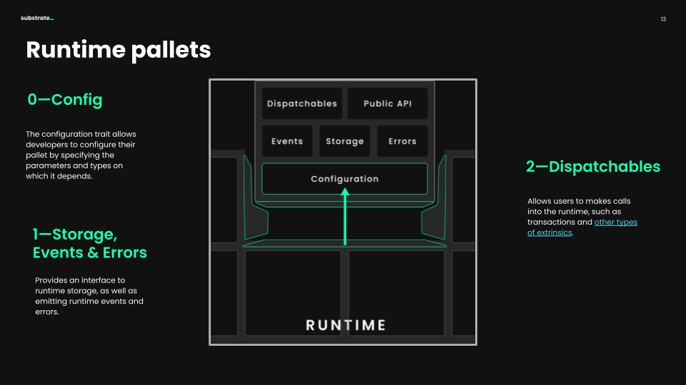

# FRAME

The runtime of a Substrate blockchain acts as the state transition function, where all of the business logic of our chain lives.
A runtime typically contains a number of pallets that, together, define the business logic of the chain.
Each [pallet](https://docs.substrate.io/reference/frame-pallets/) alone provides ways for accounts and other pallets to interact with them.
Pallets are written in [FRAME](https://docs.substrate.io/fundamentals/runtime-development/#frame), Substrate's opinionated framework for writing runtimes.
Two key libraries that make it possible to write a pallet using FRAME are:

* [`frame_system`](https://paritytech.github.io/substrate/master/frame_system/index.html): provides all core system functionalities for integrating a pallet into a runtime and enabling pallets to interact with each other.
* [`frame_support`](https://paritytech.github.io/substrate/master/frame_support/index.html): provides a pallet with a way to create dispatchable calls, storage capabilities, events and errors and [core utilities](https://docs.substrate.io/rustdocs/latest/frame_support/traits/index.html#).

As runtime engineers, a pallet provides you a way to:

* Specify storage items for your blockchain
* Specify some callable functions for your blockchain
* Emit events and errors
* Specify some custom logic for callable functions
* Generate metadata

This gives you a lot of flexibility for the logic you're writing, but this means you have a lot of responsibility for carefully handling errors.

<!-- slide:break-40 -->

Important concepts:

* Weights
* Verify first, write last
* Storage read/write efficiency
* Error handling
