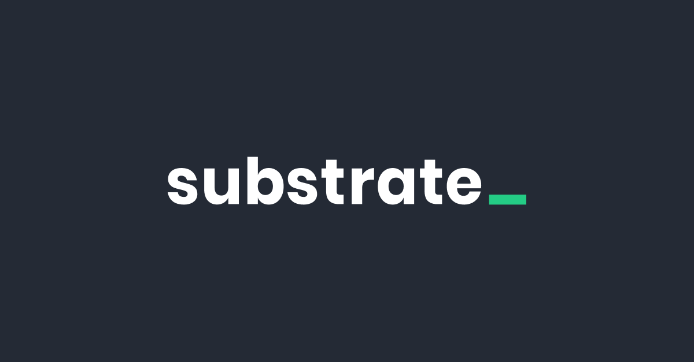

# What is Substrate?

Substrate is a framework and toolkit to develop application specific blockchains.
Application logic is encapsulated by writing specialized [runtimes](https://docs.substrate.io/v3/concepts/runtime/), which really is the executable that nodes use to run the blockchain logic of the network.

Substrate is built in Rust and uses WebAssembly for some key defining features.
WebAssembly compatibility enables provability, verification and upgradability of runtimes, useful for on-chain governance and multi-chain consensus, as well as ensuring that blockchains built with it can be platform agnostic.

Substrate provides all of the heavy lifting blockchain components out of the box:

- Database Layer
- Networking Layer
- Consensus Engine
- Transaction Queue

<!-- slide:break-40 -->

