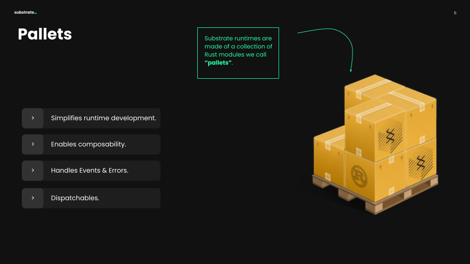

## How can I make my runtime "specialized"?

Substrate provides a way to easily write runtime logic using what Substrate calls "pallets". 
These are Rust modules, written with [FRAME](https://docs.substrate.io/v3/runtime/frame/) &mdash; Substrate's opinionated toolkit for writing runtime logic.
You can think of comparing the runtime of a Substrate blockchain to a crate, carrying all of its business logic in a multitude of different pallets.

You'll notice that our node template contains a number of pallets to provide some basic functionality, including:
- [`pallet-balances`](https://github.com/paritytech/substrate/tree/master/frame/balances): for handling accounts and balances.
- [`pallet-transaction-payment`](https://github.com/paritytech/substrate/tree/master/frame/transaction-payment): basic logic for requiring minimum fee to include a transaction in a block.
- [`pallet-sudo`](https://github.com/paritytech/substrate/tree/master/frame/sudo): designates a single account that can execute privileged functions.

In this workshop, we'll create a pallet for our node template blockchain, specialized in minting and distributing Proof of Attendance NFTs (inspired by the original [POAP NFTs](fool.com/investing/stock-market/market-sectors/financials/non-fungible-tokens/poap-nfts/)).

<!-- slide:break-40 -->

