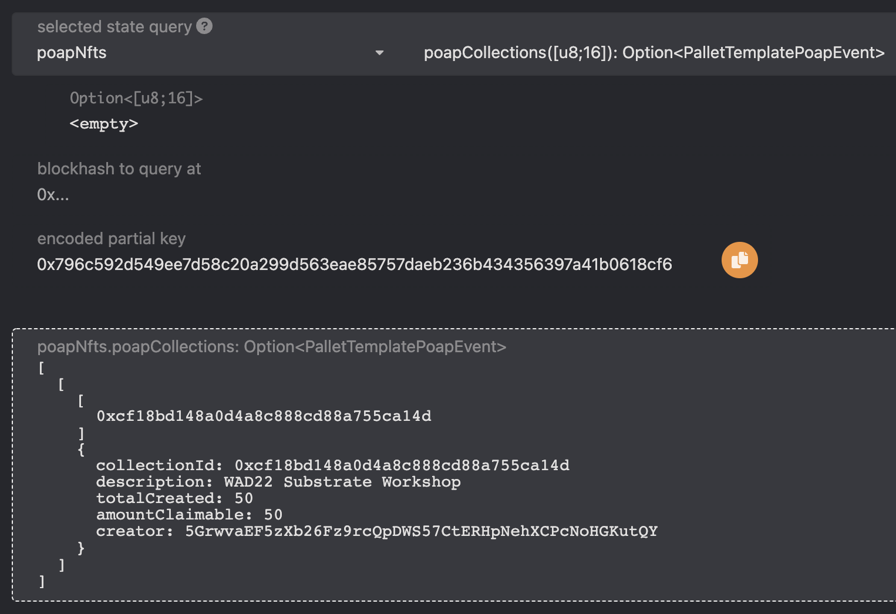

# Custom Types

We already gave you a sneak peak at defining and using custom types in Substrate.

For our Pallet, we will define two structs:
1. One to define some collection for an event, we'll call `sruct PoapEvent`.
2. Another to define some NFT from a collection, we'll call `struct PoapNft`.

Note that we take advantage of the `#[derive]` macro to implement all the different traits the Pallet expects from these custom types, just as we explained earlier. 
If you don't include these, the Rust compiler will start yelling at you as soon as you try to use these custom types. 😱

Check your code against the solution and let's move on to adding storage items for our POAP collectables!



<!-- slide:break-40 -->

<!-- tabs:start -->

#### ** ACTION ITEMS **

Add the following custom types to your Pallet.

```rust
// Struct for holding POAP Collection details (by admin)
#[derive(Clone, Encode, Decode, PartialEq, RuntimeDebug, TypeInfo, MaxEncodedLen)]
#[scale_info(skip_type_params(T))]
#[codec(mel_bound())]
pub struct PoapEvent<T: Config> {
	// Using 16 bytes to represent a unique ID
	pub collection_id: [u8; 16],
	// Vec<u8> to hold a short description
	pub description: BoundedVec<u8, T::StringLimit>,
	// Amount originally created
	pub total_created: u32,
	// Amount of NFTs left in this collection
	pub amount_claimable: u32,
	// Creator of the collection
	pub creator: T::AccountId,
}

// Struct for holding POAP NFT details
#[derive(Clone, Encode, Decode, PartialEq, RuntimeDebug, TypeInfo, MaxEncodedLen, Copy)]
#[scale_info(skip_type_params(T))]
pub struct PoapNft<T: Config> {
	// Using 16 bytes to represent the unique collection ID
	pub collection_id: [u8; 16],
	// Owner of POAP NFT
	pub owner: T::AccountId,
	// Item number of the NFT in the collection
	pub item_number: u32,
}
```

#### ** SOLUTION **

This should compile successfully by running:

```bash
cargo build -p pallet-template
```

Don't worry about warnings.

```rust
#![cfg_attr(not(feature = "std"), no_std)]

pub use pallet::*;

#[frame_support::pallet]
pub mod pallet {
	use frame_support::pallet_prelude::*;
	use frame_system::pallet_prelude::*;

	use frame_support::traits::{Currency, Randomness};

	// The basis required for building this pallet
	#[pallet::pallet]
	pub struct Pallet<T>(_);

	// Struct for holding POAP Collection details (by admin)
	#[derive(Clone, Encode, Decode, PartialEq, RuntimeDebug, TypeInfo, MaxEncodedLen)]
	#[scale_info(skip_type_params(T))]
	#[codec(mel_bound())]
	pub struct PoapEvent<T: Config> {
		// Using 16 bytes to represent a unique ID
		pub collection_id: [u8; 16],
		// Vec<u8> to hold a short description
		pub description: BoundedVec<u8, T::StringLimit>,
		// Amount originally created
		pub total_created: u32,
		// Amount of NFTs left in this collection
		pub amount_claimable: u32,
		// Creator of the collection
		pub creator: T::AccountId,
	}

	// Struct for holding POAP NFT details
	#[derive(Clone, Encode, Decode, PartialEq, RuntimeDebug, TypeInfo, MaxEncodedLen, Copy)]
	#[scale_info(skip_type_params(T))]
	pub struct PoapNft<T: Config> {
		// Using 16 bytes to represent the unique collection ID
		pub collection_id: [u8; 16],
		// Owner of POAP NFT
		pub owner: T::AccountId,
		// Item number of the NFT in the collection
		pub item_number: u32,
	}

	/* Placeholder for defining custom storage items. */

	// Your Pallet's configuration trait, representing custom external types and interfaces.
	#[pallet::config]
	pub trait Config: frame_system::Config {
		/// Because this pallet emits events, it depends on the runtime's definition of an event.
		type Event: From<Event<Self>> + IsType<<Self as frame_system::Config>::Event>;

		/// Something that provides randomness in the runtime.
		type Randomness: Randomness<Self::Hash, Self::BlockNumber>;

		/// The maximum amount of POAP NFTs a single account can own.
		#[pallet::constant]
		type MaxPoapOwned: Get<u32>;
	}

	// Your Pallet's events.
	#[pallet::event]
	#[pallet::generate_deposit(pub(super) fn deposit_event)]
	pub enum Event<T: Config> {}

	// Your Pallet's error messages.
	#[pallet::error]
	pub enum Error<T> {}

	// Your Pallet's callable functions.
	#[pallet::call]
	impl<T: Config> Pallet<T> {}

	// Your Pallet's internal functions.
	impl<T: Config> Pallet<T> {}
}
```
<!-- tabs:end -->
