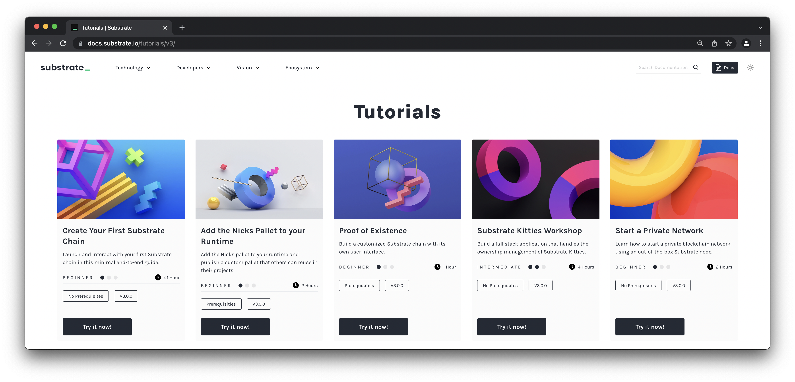

# What's next?

This workshop is just the beginning of your Substrate and Polkadot development experience. There is still a ton more to do before you become an expert!

* Add more features to the PoapNFT Pallet:
	* Make an NFT upgradable, to include votes from other attendees.
	* Extend the pallet to enable users to mint NFTs for rewarding good work in at their workplace.
* Build your own custom front-end for this PoapNft Pallet using [Polkadot JS](https://polkadot.js.org/docs/).
* Add other FRAME Pallets to your Runtime:
	* Check out just some of the Pallets Parity has built here: https://github.com/paritytech/substrate/tree/master/frame
* Start your journey to launch your first parachain with our [Cumulus Workshop](https://docs.substrate.io/tutorials/v3/cumulus/start-relay/).
* Try out any of our other [tutorials](https://docs.substrate.io/tutorials).

